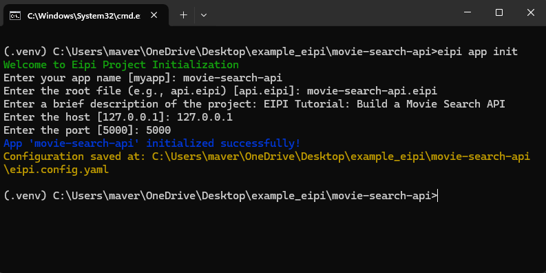
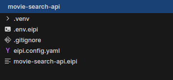

# EIPI Tutorial: Build a Movie Search API 🎥

In this tutorial, you'll learn how to build a Movie Search API using EIPI step-by-step. EIPI simplifies API creation with a declarative, configuration-based approach no need to struggle with complex setups. By the end, you’ll have a fully functional API to search for movies using the OMDb API.

?> Learn by Doing: EIPI Quickstart Tutorial 🚀
>
>This tutorial is designed for people who prefer learning through hands-on experience building something tangible right away. If you're eager to jump in and create something functional fast, you’re in the right place!
>
>If you’d rather learn EIPI step-by-step, understanding each concept in detail first, check out the section: Describing the API Workflow. There, we’ll guide you through the individual components that power EIPI, like payloads, routes, and response handling.
>
>Whichever way you choose to learn, EIPI makes building APIs fast, easy, and fun!

## Prerequisites

- Python >3.8 installed.
- Sign up for an OMDb API key from [OMDb API](https://www.omdbapi.com/apikey.aspx).
- Install EIPI using pip:

```bash
pip install eipi
```

## 1. Set Up Your EIPI App

First, create a new folder for your project. This will contain your .eipi config file, an .env file, and anything else your app needs.

```bash
mkdir movie-search-api
cd movie-search-api
```

## 2. Initializing your Movies API

You dont need to create the .eipi file and the eipi.config.yaml file manualy, it is simplified for you by the eipi cli tool, run the following on your cmd or terminal

```bash
eipi app init
```

Answer the required questions asked to configure the initial eipi configurations



This will initialize your movies API project and create for you two files which are movie-search-api.eipi, and eipi.config.yaml

## 3. Create the .env.eipi File

This file holds your API key safely.

```bash
echo "OMDB_API_KEY=your_api_key_here" > .env.eipi
```

Make sure to replace your_api_key_here with the API key you got from OMDb.



?> The `.env` file should have additial extention `.env.eipi` at the end for it to be recognized by Eipi

## 4. Define Your API in an ___movie-search-api.eipi___ File

On the movie-search-api.eipi file created by the help of eipi cli init command, now you can clear and add the following configurations to implement the movies API.

```eipi
[
  {
    "name": "MovieSearch",
    "description": "Search for movies using OMDb API",
    "method": "GET",
    "route": "/movies",
    "payload": {
      "action": {
        "url": "http://www.omdbapi.com/?apikey={{ env_OMDB_API_KEY }}&s=your_query_title",
        "method": "GET"
      },
      "append_to_response": "True"
    },
    "response": {
      "status": 200
    }
  }
]
```

## How It Works

- Route: `/movies` – The endpoint to search for movies.
- Payload: Uses the OMDb API to search for movies with a query title.
- Environment Variable: Fetches the OMDb API key from your `.env.eipi` file.

## 5. Run Your EIPI App

With everything set up, running your API is as simple as:

```bash
eipi app run
```

This command starts a local server at <http://localhost:5000>.

## 6. Test Your Movie API

Let’s test your API by searching for a movie!

Open your browser or use a tool like Postman, and visit:

```bash
http://localhost:5000/movies
```

If everything works correctly, you should get a response like this:

```json
// this is the response from our API endpoint with a total of 37 movies

{
    "status": 200,
    "request_data": {
        "data": {
            "Search": [
                {
                    "Title": "Inception",
                    "Year": "2010",
                    "imdbID": "tt1375666",
                    "Type": "movie",
                    "Poster": "https://m.media-amazon.com/images/M/MV5BMjAxMzY3NjcxNF5BMl5BanBnXkFtZTcwNTI5OTM0Mw@@._V1_SX300.jpg"
                },

                ...

            ],
            "totalResults": "37",
            "Response": "True"
        }
    }
}
```

## 7. Challenge: Add More Functionality 🎯

Let’s extend the API! Add the following to your `.eipi` file:

```eipi

// query_imdbID is the query parameter that will be used to fetch the details of a specific movie
// make the query_imdbID parameter to be "tt1375666"

[
    {
        "name": "MovieDetails",
        "description": "Fetch detailed information about a specific movie",
        "method": "GET",
        "route": "/movies/details",
        "payload": {
            "action": {
                "url": "http://www.omdbapi.com/?apikey={{ env_OMDB_API_KEY }}&i=tt1375666",
                "method": "GET"
            },
            "append_to_response": "True"
        },
        "response": {
            "status": 200
        }
    }

]
```

## 8. Recap and What's Next?

You just built a Movie Search API using EIPI! 🎉 Here’s what you’ve achieved:

- Created a GET route to search for movies by title.
- Managed API keys securely with `.env.eipi`.
- Extended functionality to fetch detailed movie data.

## Next Steps

- Experiment: Add more endpoints, like filtering by year or genre.
- Explore: Integrate a frontend with this API using React.
- Deploy: Use a service like Heroku to make your API live.

## Conclusion

With EIPI, building APIs is straightforward and fast. No complicated routing just configure and run. Keep experimenting and building awesome things! 🚀

?> [Eipi-movies-search-example](https://github.com/am-eric-kweyunga/eipi/tree/main/examples/movie-search-api "here") is the github link to the movie-search-api example
